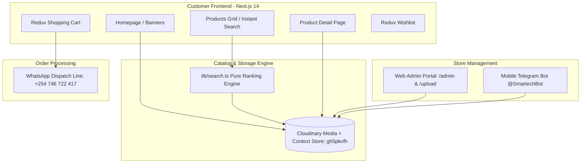

# Smartech Kenya — Complete System Documentation & Architecture Guide

**Author / Maintainer:** Benedict Guthiga  
**Version:** 2.0.0  
**Stack:** Next.js 14 (App Router) • TypeScript • Tailwind CSS • Redux Toolkit • Cloudinary Context API  

---

## 1. System Overview & Executive Summary

**Smartech Kenya** is an enterprise-grade e-commerce web platform engineered specifically for the consumer electronics and home appliances retail market in Kenya.

Unlike traditional e-commerce web applications that rely on heavy SQL/NoSQL databases with ongoing server maintenance and cold starts, Smartech Kenya utilizes a high-efficiency **Database-less / Headless Media Architecture**. The entire catalog—including product titles, brands, SKUs, pricing, compare discounts, stock levels, categories, specifications, and visibility flags—is stored and indexed directly as **Cloudinary Context Metadata** attached to image assets.

Orders are processed via a streamlined **WhatsApp-first checkout pipeline**, generating structured order manifests sent directly to the sales and dispatch desk (`+254 746 722 417`). In addition, store operators can update catalog imagery and products using the feature-packed web **Admin Portal**.

---

## 2. Architectural Pillars



### 1. Database-less Cloudinary Context Catalog
- Products are stored under the Cloudinary folder `smartech-products/*`.
- Product attributes are serialized into pipe-delimited key-value context strings (e.g., `sku=...|name=...|price=...|brand=...|category=...`).
- When querying the catalog, Next.js calls the Cloudinary Search API, parses the context back into typed TypeScript interfaces (`CldProduct`), and serves the data instantly without database cold starts or hosting fees.

### 2. Pure Deterministic Search Ranking (`lib/search.ts`)
- Standalone, zero-dependency search scoring module.
- Exact product name matches receive **1000 points**, exact SKUs receive **900 points**, and exact brand+name queries receive **800 points**.
- Implements strict **AND-word conjunction**: all words in a multi-word search must exist in the product, preventing false positives (e.g., "Hisense blender" returns 0 instead of returning every TV and blender).

### 3. WhatsApp & Direct Phone Checkout
- Items added to the cart are stored in Redux and synchronized with `localStorage`.
- When checking out, the app compiles a clean message with product names, quantities, and total KES amounts, launching WhatsApp to finalize delivery details with the dispatch team (`+254 746 722 417`).

### 4. Dual-Channel Inventory Ingestion
- **Web Admin Dashboard** (`/admin` and `/upload`): Password-protected interface (`ADMIN_SECRET=Smartech.ke@2026`) for desktop catalog management, bulk edits, drag-and-drop folder matching, and homepage hero banner customization.
- **Telegram Bot Webhook** (`/api/webhook/telegram`): Store staff can take a photo of an appliance in the showroom, caption it with the SKU, and send it to the Telegram bot to immediately update the live product image on the storefront.

---

## 3. Exhaustive File-by-File Reference

### 3.1. Project Root & Configuration

| File | Type | Description |
| :--- | :--- | :--- |
| `package.json` | Config | Defines package metadata, scripts (`dev`, `build`, `start`, `test`, `lint`, `type-check`), and dependencies (`next`, `react`, `@reduxjs/toolkit`, `cloudinary`, `lucide-react`, `react-hot-toast`, `sharp`, `zod`). |
| `next.config.js` | Config | Next.js configuration enabling remote Cloudinary image domains (`res.cloudinary.com`) and compiler optimizations. |
| `tailwind.config.js` | Config | Tailwind design system configuration. Defines custom color tokens (`brand`, `ink`, `cream`, `accent`), font families (`Outfit`, `Plus Jakarta Sans`), and typography plugins. |
| `tsconfig.json` | Config | TypeScript compiler configuration with strict type checking, ES2022 target, and `@/*` alias mapping. |
| `postcss.config.js` | Config | PostCSS configuration loading `tailwindcss` and `autoprefixer`. |
| `jest.config.js` | Config | Jest test runner setup using `next/jest` for unit and component testing. |
| `jest.setup.js` | Config | Extends Jest testing environment with `@testing-library/jest-dom`. |
| `.eslintrc.json` | Config | ESLint configuration extending `next/core-web-vitals`. |
| `.gitignore` | Config | Specifies Git untracked files (`node_modules`, `.next`, `.env*`, build caches). |
| `.env.example` | Config | Template listing required environment variables (`CLOUDINARY_*`, `ADMIN_SECRET`, `NEXT_PUBLIC_APP_URL`, `TELEGRAM_*`). |
| `CHANGES.md` | Doc | Historical changelog detailing architectural refactoring, dead code cleanup, and design system updates. |
| `PUSH.bat` | Script | Windows automation script for running git staging, deletion cleanup, commits, and pushes. |
| `DOCUMENTATION.md` | Doc | This comprehensive system architecture and operation manual. |

---

### 3.2. App Router Pages (`app/`)

| File / Directory | Route | Description |
| :--- | :--- | :--- |
| `app/layout.tsx` | Global Layout | Root layout component. Configures SEO metadata, OpenGraph tags, Google Fonts, Redux `<Providers>`, global `<Header>`, `<Footer>`, and toast notifications. |
| `app/page.tsx` | `/` | Homepage. Loads dynamic hero banners from Cloudinary (`smartech-hero/*`), category quick-links, trust badges, flash deal carousels, popular brands, and featured product grids. |
| `app/globals.css` | Global CSS | Global stylesheet containing Tailwind directives, font imports, custom button classes (`.btn-accent`, `.btn-dark`), card styling, skeleton loaders, and non-italic price rules (`.price`). |
| `app/loading.tsx` | Loading UI | Global suspense fallback displayed during page transitions. |
| `app/error.tsx` | Error Boundary | Client-side error boundary that catches unhandled errors and displays a user-friendly recovery UI. |
| `app/not-found.tsx` | 404 Page | Custom Not Found page with redirect links back to the catalog. |
| `app/robots.ts` | `/robots.txt` | Generates search crawler indexing directives. |
| `app/sitemap.ts` | `/sitemap.xml` | Dynamically produces XML sitemap for SEO discovery. |
| `app/icon.png` | Asset | 256x256 square favicon (S on cart wheels) for desktop browsers. |
| `app/apple-icon.png` | Asset | 180x180 square icon for iOS mobile web clips. |
| `app/(shop)/products/page.tsx` | `/products` | Catalog listing page. Displays products immediately at first sight without blocking hero panels or sidebars; supports real-time category, brand, and search filters in a 4-column responsive grid. |
| `app/(shop)/products/[slug]/page.tsx` | `/products/[slug]` | Product details page. Resolves products by SKU/slug, renders high-res image viewers, pricing comparisons, specifications, stock status, and direct WhatsApp ordering. |
| `app/(shop)/cart/page.tsx` | `/cart` | Interactive cart page. Allows quantity updates, item deletions, cost calculations, and modal checkout triggers for WhatsApp manifests. |
| `app/(auth)/login/page.tsx` | `/login` | Customer login view with styled email/password inputs. |
| `app/(auth)/register/page.tsx` | `/register` | Customer account registration view. |
| `app/(legal)/privacy/page.tsx` | `/privacy` | Privacy policy and data protection disclosure. |
| `app/(legal)/terms/page.tsx` | `/terms` | Customer Terms of Service, warranty information, and delivery policies. |
| `app/admin/page.tsx` | `/admin` | Comprehensive admin dashboard with 6 specialized tabs: Direct Upload, Image Manager, Folder Upload (drag-and-drop), Add Product, Manage (inline Edit & Delete), and Hero Carousel Management. |
| `app/upload/page.tsx` | `/upload` | Fast mobile-friendly interface for creating and uploading single products to Cloudinary. |
| `app/wishlist/page.tsx` | `/wishlist` | Displays customer's saved items stored in Redux/localStorage. |
| `app/track-order/page.tsx` | `/track-order` | Order status lookup page linking directly to dispatch support. |
| `app/contact/page.tsx` | `/contact` | Store location (Gaberone Plaza, Nairobi), customer care phone numbers, opening hours, and enquiry form. |
| `app/forgot-password/page.tsx` | `/forgot-password` | Self-service password recovery instructions. |

---

### 3.3. API Routes & Webhooks (`app/api/`)

| Endpoint | Method(s) | Description |
| :--- | :--- | :--- |
| `app/api/products/route.ts` | `GET` | Public API returning paginated product lists with category, brand, price, and search query filters. |
| `app/api/products/[id]/route.ts` | `GET` | Public API returning individual product details by SKU. |
| `app/api/admin/products/route.ts` | `POST` | Protected endpoint (`ADMIN_SECRET`) to create a product and upload its image/context metadata to Cloudinary. |
| `app/api/admin/manage/route.ts` | `GET`, `PATCH`, `DELETE` | Protected management endpoint to list all items (including inactive), update context metadata (name, price, stock, etc.), or delete assets permanently from Cloudinary. |
| `app/api/admin/hero/route.ts` | `GET`, `POST`, `DELETE` | Manages homepage carousel banners stored in `smartech-hero/*`. |
| `app/api/admin/upload-image/route.ts` | `POST` | Protected route for updating product photos while preserving existing context metadata. |
| `app/api/admin/cloudinary-upload/route.ts` | `POST` | Admin utility for generating signed Cloudinary upload payloads. |
| `app/api/admin/debug/route.ts` | `GET` | Protected diagnostic endpoint testing Cloudinary connectivity and environment configuration. |
| `app/api/webhook/telegram/route.ts` | `POST` | Telegram Bot webhook. Receives incoming photos from authorized store admin, extracts the SKU from the caption, downloads the photo, and updates Cloudinary. Supports `LIST` and `SEARCH` text commands. |
| `app/api/webhook/whatsapp/route.ts` | `GET`, `POST` | Deprecated Twilio endpoint returning HTTP 410 redirecting to Telegram. |
| `app/api/auth/[...nextauth]/route.ts` | `GET`, `POST` | Stub route returning HTTP 501 preserving link safety. |
| `app/api/register/route.ts` | `POST` | Stub route returning HTTP 501 preserving link safety. |

---

### 3.4. Core Libraries (`lib/`)

| File | Exports | Description |
| :--- | :--- | :--- |
| `lib/cloudinary.ts` | `listProducts`, `getProductBySku`, `getProductBySlug`, `createProduct`, `updateProductImage`, `updateProductContext`, `deleteProduct`, `listHeroImages`, `uploadHeroImage`, `deleteHeroImage` | The central data access layer. Communicates with Cloudinary REST API, signs requests via SHA-1 crypto hashes, serializes product fields into pipe-delimited strings, and parses Cloudinary responses into typed product objects. Directly pulls 100% live assets from your Cloudinary storage. |
| `lib/search.ts` | `scoreProduct`, `rankBySearch`, `norm` | Pure search ranking module. Evaluates query terms against product names, SKUs, brands, and descriptions using multi-tier scoring and AND-conjunction rules. |
| `lib/format.ts` | `formatPrice`, `formatDate`, `formatPhone`, `truncate`, `slugify` | Utility functions for formatting Kenyan Shillings (`KES`), Kenyan phone numbers (`+254`), dates, and URL slugs. |

---

### 3.5. UI & Layout Components (`components/`)

| Component | Path | Description |
| :--- | :--- | :--- |
| `Header` | `components/layout/Header.tsx` | Main navigation header. Features Gaberone Plaza topbar, customer care dialer, brand logo, search input, category links, wishlist icon, and cart counter. |
| `Footer` | `components/layout/Footer.tsx` | Comprehensive site footer with company details, category links, legal links, M-Pesa badges, and store location. |
| `Providers` | `components/layout/Providers.tsx` | Client-side provider wrapping the React tree with Redux `<Provider store={store}>`. |
| `ProductCard` | `components/product/ProductCard.tsx` | Product grid item component with thumbnail, discount badge, low-stock warning, price display (`.price`), rating stars, and quick Add-to-Cart button. |
| `ProductList` | `components/product/ProductList.tsx` | Grid container for rendering lists of `ProductCard` with pagination and empty states. |
| `ProductDetail` | `components/product/ProductDetail.tsx` | Single product showcase component with zoomable image viewer, pricing, stock indicators, spec tables, and WhatsApp order trigger. |
| `ProductFilters` | `components/product/ProductFilters.tsx` | Sidebar/modal filter component for category selection, brand checkboxes, and price sliders. |
| `AddToCartButton` | `components/product/AddToCartButton.tsx` | Interactive button providing immediate visual and toast feedback when adding items to the cart. |
| `FeaturedProducts` | `components/product/FeaturedProducts.tsx` | Curated product grid showcasing highlighted items on the homepage. |
| `SearchBar` | `components/search/SearchBar.tsx` | Debounced search input that triggers instant queries across the catalog. |
| `Button` | `components/ui/Button.tsx` | Reusable button primitive supporting primary, outline, and ghost variants. |

---

### 3.6. State Management (`store/`)

| File | Slice / Store | Description |
| :--- | :--- | :--- |
| `store/index.ts` | Root Store | Configures the Redux store combining `cart` and `wishlist` reducers, exporting `RootState` and `AppDispatch`. |
| `store/slices/cartSlice.ts` | `cart` | Manages shopping cart state (`items`, `totalAmount`, `totalQuantity`). Automatically initializes from and saves to `localStorage`. |
| `store/slices/wishlistSlice.ts` | `wishlist` | Manages customer's saved items (`items`). Automatically initializes from and saves to `localStorage`. |

---

### 3.7. Types, Constants & Tests

| File | Description |
| :--- | :--- |
| `constants/categories.ts` | Taxonomy constants defining categories (`Technology`, `Kitchen & Home`), subcategories (Smart TVs, Fridges, Cookers, etc.), and popular Kenyan brands (Samsung, LG, Hisense, Ramtons, Mika, etc.). |
| `types/index.ts` | TypeScript interfaces for `Product`, `Category`, `Review`, `Order`, `SafeUser`, `ApiResponse`, and `PaginatedResponse`. |
| `tests/search.test.mjs` | Automated test suite verifying `lib/search.ts` ranking logic, exact matches, word-conjunction filtering, and stability (20 passing tests). |

---

## 4. Operational Workflows & Features

### A. Admin Panel Features (`/admin`)
Authenticated via password: `Smartech.ke@2026`
1. **⚡ Direct Upload**: Upload any standalone image directly to Cloudinary and instantly copy its CDN URL.
2. **🖼 Image Manager**: Visual gallery of all inventory items showing which ones need photos and which ones have photos.
3. **📁 Folder Upload (Drag & Drop)**: Select a folder or drag and drop multiple product photos at once. The system automatically extracts SKUs from filenames (e.g. `MIKA-WM-8KG.jpg`) and matches them to products.
4. **＋ Add Product**: Create a new product with brand, name, category, subcategory, price, compare price, stock, and photo.
5. **✎ Manage Products (Edit & Delete)**:
   - **Inline Edit Modal**: Modify name, brand, category, pricing, stock, description, and drag-and-drop replacement photos with instant live updates.
   - **Delete with Safety Confirmation**: Permanently destroys the asset and metadata in Cloudinary.
   - **Instant Toggles**: One-click toggles for "Featured" (homepage spotlight) and "Active" (hide/show item without deleting).
6. **🖼 Hero Images**: Manage homepage carousel banners stored in `smartech-hero/*`.

### B. Catalog Lifecycle (100% Live Cloudinary Store)
1. **Clean Zero-State**: If your Cloudinary cloud is fresh and empty, the catalog displays 0 products ("No products found yet").
2. **Pure Live Catalog**: Every product, photo, price, and description shown to customers comes 100% exclusively from your live Cloudinary account (`gh5pkvfh`) in `smartech-products/*`. No sample products or Unsplash images will ever appear.

### C. Customer Search & Discovery Flow
```
Customer types "Hisense 43" in SearchBar
  └─► Next.js calls /api/products?search=Hisense+43
        └─► lib/cloudinary.ts fetches resources from 'smartech-products/*'
              └─► lib/search.ts scores each item (Exact Name = 1000, Brand+Name = 800)
                    └─► Sorted products returned & displayed in clean 4-col grid
```

### D. Cart & WhatsApp Checkout Flow
```
Customer clicks "Add to Cart"
  └─► Redux cartSlice dispatches addToCart action
        └─► Cart state saved to localStorage & Cart badge increments
              └─► Customer opens /cart and clicks "Place Your Order"
                    └─► App compiles items & total into formatted WhatsApp message:
                        "Hello Smartech Kenya! I would like to order:
                         - Hisense 43" Smart TV x1 - KES 32,999
                         Total: KES 32,999"
                    └─► Opens WhatsApp chat with +254 746 722 417
```

### E. Telegram Mobile Photo Tagging Flow
```
Store staff takes photo of appliance on phone
  └─► Staff sends photo to Telegram Bot with caption "MIKA-FRIDGE-200L"
        └─► Telegram webhook hits /api/webhook/telegram
              └─► Webhook verifies TELEGRAM_OWNER_ID
                    └─► Downloads high-res photo from Telegram servers
                          └─► Overwrites Cloudinary asset 'smartech-products/MIKA_FRIDGE_200L'
                                while preserving all existing pricing and description context
```

---

## 5. Styling & Visual Standards

1. **Clean White Theme**: Base background is pure `#FFFFFF` (`app/globals.css`, `tailwind.config.js`).
2. **Typography**: Headings `h1`–`h6` are bold (`700`), body text is medium (`500`), product names are `font-semibold`.
3. **Price Styling**: 
   - Styled in bright blue (`#0066FF`).
   - Strictly non-italic (`font-style: normal !important`).
   - Tabular numbers (`font-variant-numeric: tabular-nums`) for clean vertical alignment.
4. **Favicon**: Multi-resolution square logo badge (`app/icon.png` 256×256 and `app/apple-icon.png` 180×180).

---

## 6. Deployment & Environment Setup

### Production Environment Variables

| Variable | Description | Value |
| :--- | :--- | :--- |
| `CLOUDINARY_CLOUD_NAME` | Cloudinary account cloud name | `gh5pkvfh` |
| `CLOUDINARY_API_KEY` | Cloudinary API key | `674374114256321` |
| `CLOUDINARY_API_SECRET` | Cloudinary API secret | `0Gk1X0w-wLuGyUCqtOP6VoBdQ8E` |
| `ADMIN_SECRET` | Secret password for admin access | `Smartech.ke@2026` |
| `NEXT_PUBLIC_APP_URL` | Application root URL | `https://smartechkenya.co.ke` |

### Vercel Deployment Checklist

1. Push repository to GitHub/GitLab:
   ```bash
   git add .
   git commit -m "Smartech Kenya v2.0 - Complete system verified"
   git push origin main
   ```
2. In Vercel, select **Import Project** and choose the repository.
3. Framework Preset: **Next.js** (Root directory: `./` or `Smartech Kenya`).
4. In **Settings → Environment Variables**, paste the 5 keys from the table above.
5. Click **Deploy**. Vercel will build all 31 routes cleanly and deploy to production in ~1 minute.

---

*Documentation compiled and verified for Benedict Guthiga — Smartech Kenya 2.0.0.*
